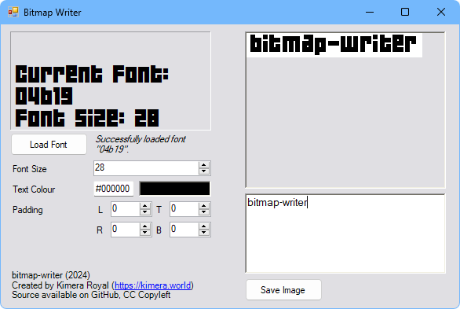

This tool is used to generate PNG images using bitmap fonts. This is specifically useful for displaying bitmap fonts on web, as browsers have unavoidable settings that destroy their quality.

This program is fully functional, though you may notice a little bit of weird trimming / kerning. This seems to be an unavoidable fact of life when using System.Drawing to render out text, but I will continue looking for a solution.
